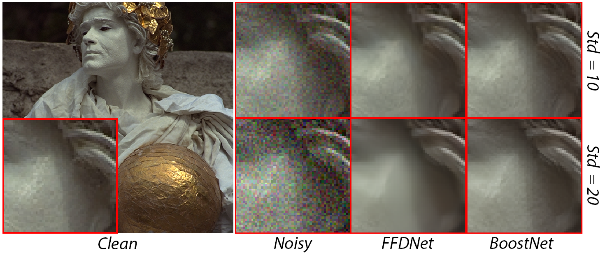
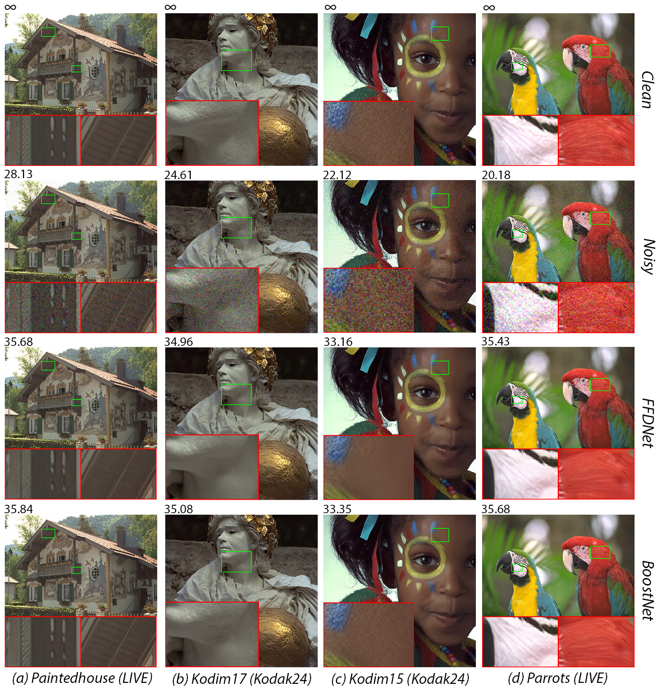
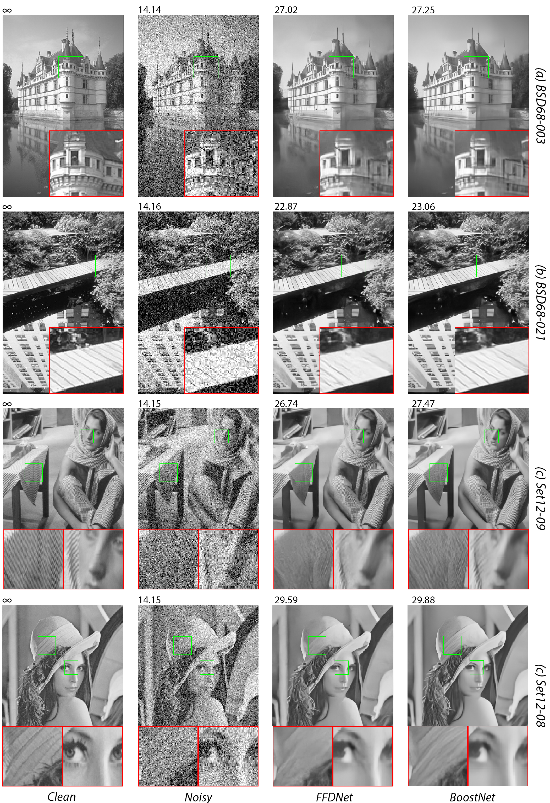
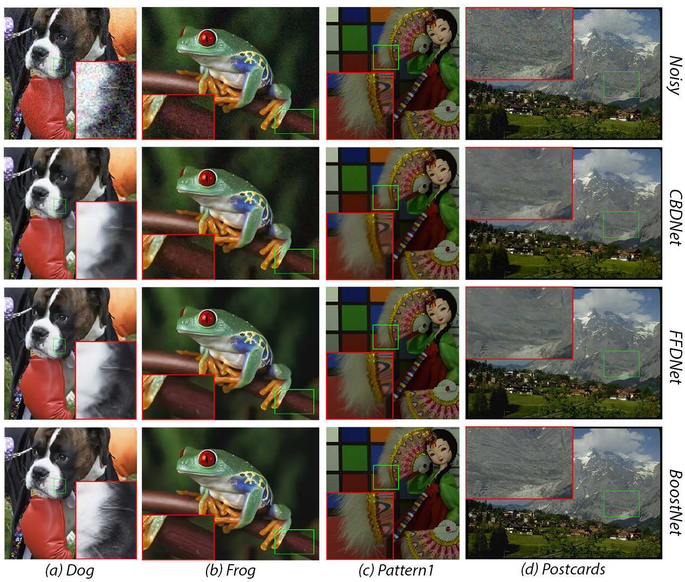

# BoostGAN: An Enhanced Generative Adversarial Network for Image Blind Denoising.

## Requirements
- python       3.6
- pytorch      1.0
- CUDA         8.0 or 9.0

## Datasets
1. Trainsets
[Waterloo Exploration Database](https://ece.uwaterloo.ca/~k29ma/exploration/),
[FMD](https://github.com/yinhaoz/denoising-fluorescence?fbclid=IwAR1_tkfour-pboC0VpVxXGGcAGu5ChUj6b0KAYom2zJtmM3OjQnkVy6GHBQ)
2. Testsets
[BSD68](https://github.com/ZeroZero19/BoostNet/tree/master/testsets/BSD68),
[CBSD68](https://github.com/ZeroZero19/BoostNet/tree/master/testsets/CBSD68),
[Set12](https://github.com/ZeroZero19/BoostNet/tree/master/testsets/Set12),
[Kodak24](https://github.com/ZeroZero19/BoostNet/tree/master/testsets/Kodak24), 
[McMaster](https://github.com/ZeroZero19/BoostNet/tree/master/testsets/McMaster), 
[RNI15](https://github.com/ZeroZero19/BoostNet/tree/master/testsets/RNI15),
[LIVE1](https://github.com/ZeroZero19/BoostNet/tree/master/testsets/LIVE1),
[Set5](https://github.com/ZeroZero19/BoostNet/tree/master/testsets/Set5),
[Set14](https://github.com/ZeroZero19/BoostNet/tree/master/testsets/Set14),
[FMD_test_mix](https://github.com/ZeroZero19/BoostNet/tree/master/testsets/cell/fmd_test_mix),
[Our_data](https://github.com/ZeroZero19/BoostNet/tree/master/testsets/cell/our_data),

## Usage
### 1. Test on gray image
`python test_gray.py`

### 2. Test on rgb image with noisy sigma level
`python test_rgb.py`

### 3. Test on rgb real noise image
`python test_rgb_realnoise.py`

### 3. Test Real Fluorescence Microscopy Images
`python test_cell.py`
Optional
- `--image-types` : choices=['fmd_test_mix', 'our_data'], default='fmd_test_mix'
- `--out-dir` : output folder
- `--net` : choices=['N2N', 'DnCNN','EstNet', 'GeNet', 'GaNet', 'BoostNet', 'all'], default='all'

## Sample results 
kodim17 
  
kodak24 
 
Set12 
 
RIN15 
 
FMD 
 

